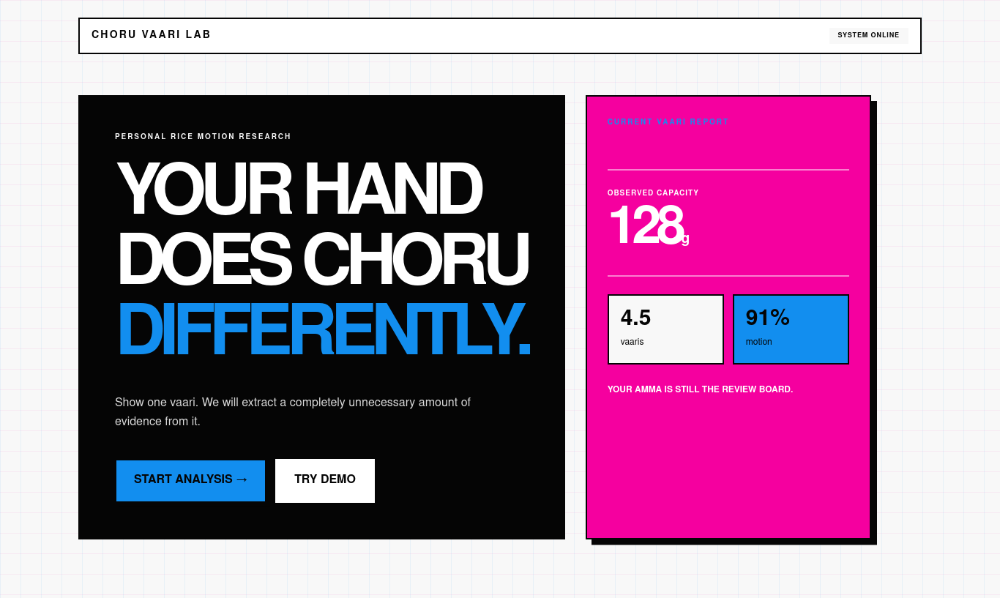
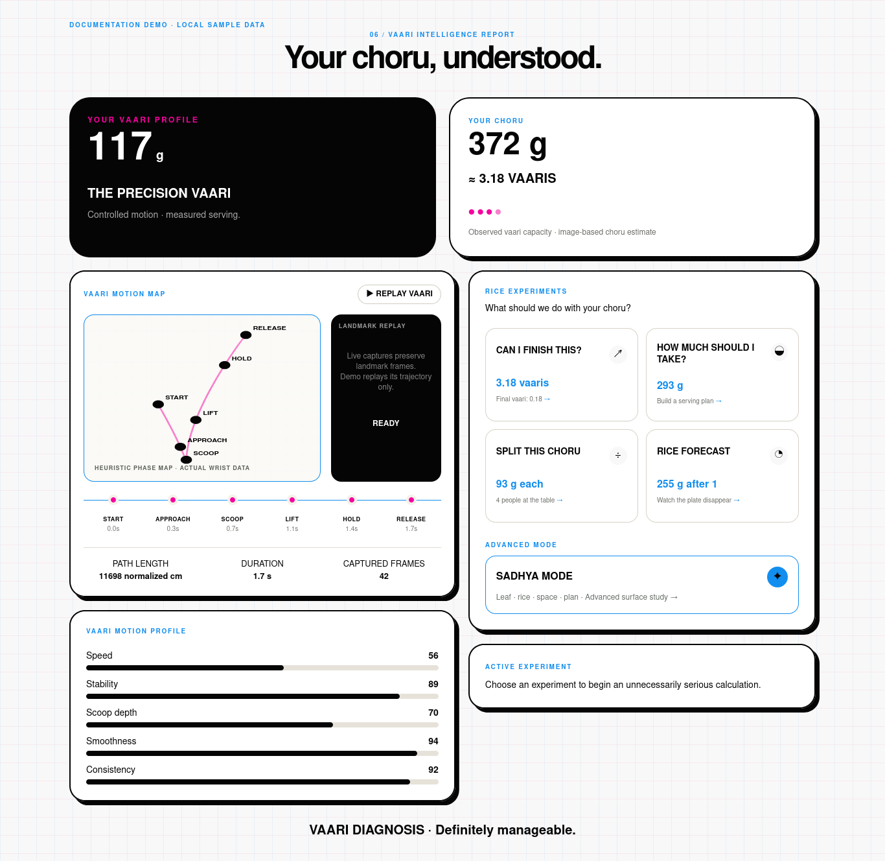
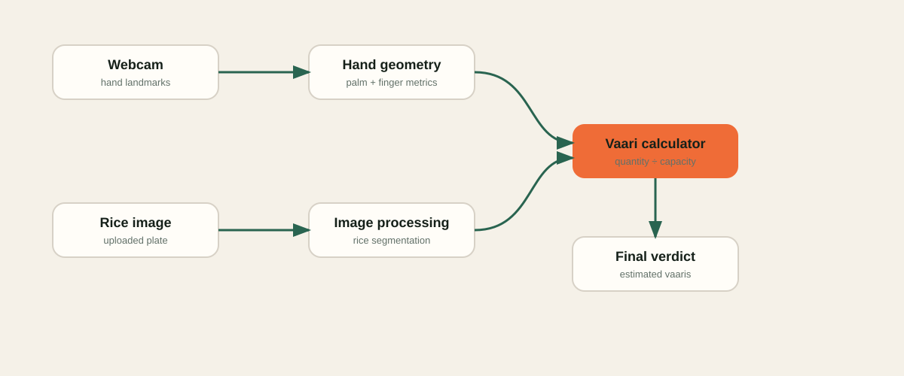

# Choru Vaari Kodukkam 🎯

## Basic Details
### Team Name
DIVA

### Team Members
- Team Lead: Noel Biju - Sahrdaya College of Engineering and Technology
- Member 2: Samuel Thomas C - Sahrdaya College of Engineering and Technology

### Project Description
Choru Vaari Kodukkam estimates a personal rice-handful capacity from hand landmarks, then estimates the quantity of choru in a plate image and expresses it in vaaris.

### The Problem (that doesn't exist)
“Ente oru vaari choru ethra aanu?” is usually answered with vibes, family intuition, and a serving spoon.

### The Solution (that nobody asked for)
We turn it into a solemn computer-vision workflow: hand geometry estimates vaari capacity, Canvas segmentation estimates choru, and a calculator delivers a verdict of suspicious importance.

## Technical Details
### Technologies/Components Used
For Software:
- TypeScript, React, Next.js
- Tailwind CSS
- MediaPipe Tasks Vision (hand landmarks)
- Canvas API (local rice-region segmentation)
- Browser MediaDevices API

For Hardware:
- Webcam (optional; demo mode works without it)
- A device capable of displaying a very serious rice dashboard

### Implementation
For Software:
# Installation
```bash
npm install
```

# Run
```bash
npm run dev
```

Open `http://localhost:3000`. The **Try Demo** path uses predefined hand data and a local sample plate image.

### Project Documentation
For Software:

# Screenshots

*Landing page: begin a personal choru-and-vaari motion study or launch the local demo.*


*Vaari Intelligence report: recorded trajectory map, motion profile, choru estimate and interactive experiment deck.*

# Diagrams

*Webcam landmarks and plate-image segmentation meet at the vaari calculator before producing a verdict.*

### Project Demo
# Video
[Add your demo video link here]
*The video should show the calibration-to-verdict workflow.*

# Additional Demos
- Use the in-app **Try Demo** button for a local sample run.

## Team Contributions
- Noel Biju : Hand tracking, vaari estimation, frontend
- Samuel Thomas C : Rice image analysis, UI, testing

---
Made with ❤️ at TinkerHub Useless Projects


